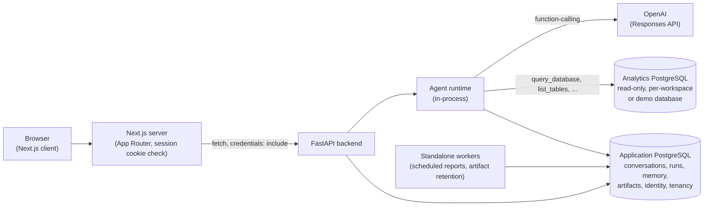
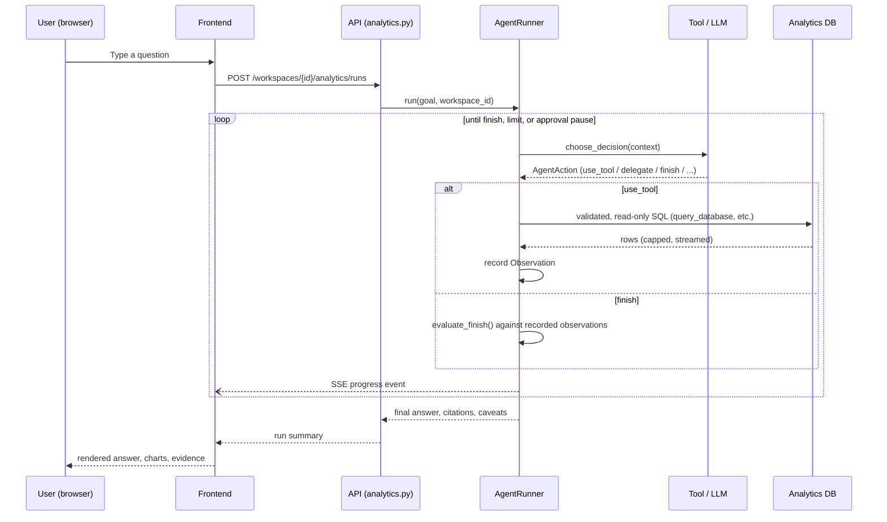
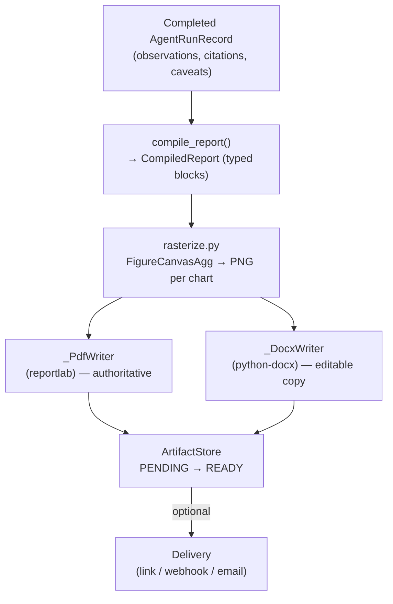

# Architecture overview

## Product purpose

`autonomous-agent` is a bounded-autonomy agent that investigates a PostgreSQL analytics
database on a user's behalf, cites the queries behind every figure it produces, and can
publish the result as a PDF or Word document. It is exposed through a Next.js frontend
("the Workbench") that also implements its own authentication, multi-tenant workspaces,
saved/scheduled reports, and delivery (link, webhook, email) — none of which route through
the LLM. The project is simultaneously a working analytics product and a study in
constrained autonomy: every limit, gate, and verification described in these documents
exists in code, not only in a system prompt.

## Main system components

| Component | Technology | Responsibility |
|---|---|---|
| Frontend ("the Workbench") | Next.js 16 (App Router), React 19 | Auth UI, workspace/tenant switching, chat composer, chart/report rendering, SSE consumption |
| Backend API | FastAPI | HTTP surface: auth, tenancy, agent runs, analytics, reports, scheduling, delivery |
| Agent runtime | Python, in-process with the API | The decision→action→observation loop — see [agent-runtime.md](agent-runtime.md) |
| Application database | PostgreSQL | Conversations, runs, memory, artifacts, identity, tenancy, saved/scheduled reports, audit log — see [persistence.md](persistence.md) |
| Analytics database | PostgreSQL (external to this app) | The read-only data the agent investigates — either a process-wide demo database or a workspace-connected source — see [data-analysis.md](data-analysis.md) |
| LLM provider | OpenAI (Responses API) | The only concrete `LLMClient` implementation — see below |

There is no message queue, cache layer, or container orchestration in this system —
the backend is a single FastAPI process, optionally joined by two standalone worker
scripts (scheduled-report execution and artifact retention) that poll the application
database rather than consuming from a queue.

## Request lifecycle

A typical Workbench interaction: the browser holds an HttpOnly session cookie
(see [authentication-and-tenancy.md](authentication-and-tenancy.md)); every request to a
workspace-scoped route resolves a `TenantContext` before any domain logic runs; an agent
run is created, executed in-process, and its progress streamed back over Server-Sent
Events; a finished run can optionally be compiled into a published document. Diagrams 2
and 3 below show the two lifecycles that matter most: running an analysis, and publishing
its result.

## Backend / frontend / database interaction

The frontend never talks to either database directly — `frontend/src/lib/api/client.ts`
is the only place a network call originates from the browser side, and it only ever
targets the FastAPI backend.

## External model/provider interaction

The only concrete LLM integration is `OpenAIClient` (`backend/app/llm/openai_client.py`),
implementing the provider-neutral `LLMClient` interface
(`backend/app/llm/contracts.py`). Each iteration of the agent loop builds native OpenAI
function-calling definitions from the currently available tools, skills, and specialists,
calls the Responses API with `tool_choice="required"`, and parses the single returned
function call back into a validated `AgentAction`
(`backend/app/contracts/actions.py`) — see [agent-runtime.md](agent-runtime.md) for what
happens if that parsing fails. No other model provider is implemented; the interface is
provider-neutral in shape, but only one provider exists in code today.

## Important package boundaries

The backend enforces its module structure with executable tests, not just convention —
`backend/tests/contracts/test_package_boundaries.py` walks the AST import graph of every
file under `backend/app/` and fails the suite on:

- **Any import cycle between top-level packages** (`test_no_package_import_cycles`).
- **`contracts` and `core` importing anything outside each other** — they are declared
  leaf packages precisely so other packages can describe what they consume (a tool's
  input, an action's shape) without importing the runtime that consumes them
  (`backend/app/contracts/__init__.py`: *"Nothing here may import from another `app`
  package except `app.core`"*).
- **`llm`, `security`, and `memory` staying free of a dependency on the runtime** —
  the check itself still tests for an import of `app.agent`
  (`test_provider_and_storage_packages_do_not_import_the_runtime`), a package name that no
  longer exists in this codebase (the runtime package is `app.runtime`); this is a stale
  artifact of an earlier restructuring and the check is currently a no-op rather than a
  live guard — see [backend.md](backend.md#known-inconsistencies) for detail.

Three package names are easy to conflate and are disambiguated fully in
[backend.md](backend.md): `runtime/` (the actual decision loop), `orchestration/` (the run
lifecycle and document publishing *around* a runtime run, not the loop itself), and
`composition/` (the dependency-injection root that wires concrete implementations
together — it composes the object graph, not prompts or pipelines).

## Agent-run lifecycle

See [agent-runtime.md](agent-runtime.md) for exactly what is runtime-enforced at each step
versus what is only a model instruction.

## Report-publishing lifecycle

See [reporting.md](reporting.md) for the compiled-report model, block kinds, and the
PDF-authoritative policy.

## Known limitations relevant to this overview

- No message queue, container orchestration, or CI exists — see the root
  [`docs/README.md`](../README.md) planned-documentation list for what's tracked
  separately.
- The scheduling and retention workers (`backend/scripts/run_scheduled_reports.py`,
  `run_artifact_retention.py`) poll the application database directly; there is no
  supervisor bundled with the repository to keep them running.
