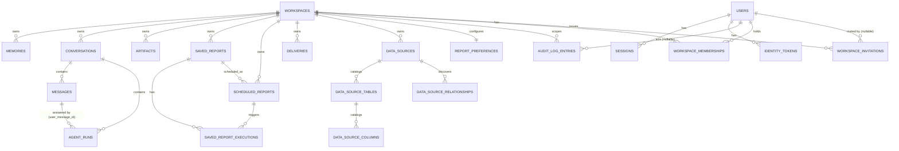

# Persistence

All application persistence lives in one PostgreSQL database (`DATABASE_URL`), modeled in
a single file, `backend/app/db/records.py` (20 SQLAlchemy ORM classes). This is separate
from the analytics database (`ANALYTICS_DATABASE_URL`) the agent investigates — see
[data-analysis.md](data-analysis.md). Several storage-backed domains (memory, artifacts,
identity, tenancy) can also run `in_memory` instead of `postgres` — see
[configuration.md](../getting-started/configuration.md) — in which case none of what
follows is durable across a process restart.

## Entity relationships

`workspaces` is the tenancy root every other table (directly or transitively) hangs off
of — see [authentication-and-tenancy.md](authentication-and-tenancy.md). Two intentional
gaps in the diagram: `artifacts.run_id` and `deliveries.artifact_id` carry no foreign key
at all (both are deliberately loose references, so the artifact backend remains swappable
without a hard database dependency between the two), and `memories`/`messages`'
`run_id`/`session_id` columns are plain correlation strings, not foreign keys.

## Users and tenants

- **`users`** — email (unique), display name, Argon2id password hash, active/
  email-verified flags, a pending-email field for in-flight email changes, and per-user
  display preferences: `preferred_timezone` (default UTC), `preferred_locale` (default
  en-US). No per-user currency, number-format, or fiscal-year setting exists — those are
  workspace-level only.
- **`workspaces`** — name, unique slug, active flag, and per-workspace defaults:
  timezone, locale, currency, fiscal year start month, number format, date format — plus
  an optimistic-concurrency `version` counter incremented on update.
- **`workspace_memberships`** — links a user to a workspace with a `role`
  (OWNER/ADMIN/ANALYST/VIEWER) and a status; unique on (user, workspace).
- **`workspace_invitations`** — email, role, hashed token, expiry, acceptance/revocation
  timestamps. A partial unique index enforces at most one *pending* invitation per
  (workspace, email) pair, while still allowing a new invitation after an old one was
  accepted or revoked.

## Conversations and runs

- **`conversations`** — a workspace-owned thread; just a title and timestamps.
- **`messages`** — role, content, and the conversation it belongs to.
- **`agent_runs`** — one row per agent run, linked to both its conversation and the
  specific user message that triggered it. Carries `status`, timing, and — notably —
  **denormalized result data**: `metrics`, `chart_specs`, `answer_sources`, and
  `answer_caveats` are stored as JSONB directly on the run row rather than in separate
  tables, so a run's full result is readable without a join.

## Messages and traces

Messages (above) are durable. **Traces are not.** `RunTrace`/`TraceEvent`
(`backend/app/observability/events.py`) — the fine-grained, per-iteration record of what
the agent actually did (every LLM call, tool call, retry, and delegation) — has no table
in `records.py` and no Postgres-backed store anywhere in the codebase. The only concrete
`TraceStore` implementation is `InMemoryTraceStore`, explicitly documented as
process-local and non-persistent: traces disappear on an API restart, bounded to the most
recent 1,000 in memory. What survives a restart is only the **denormalized summary**
already described above (`agent_runs.answer_sources`/`answer_caveats`) — the full,
step-by-step trace a run's evidence was originally resolved against does not.

## Memory

**`memories`** — workspace-scoped, typed `working`/`episodic`/`long_term`, with a free-text
`content` column and a `metadata` JSONB blob (tags live inside this blob by convention,
not as their own column). There is no embedding/vector column on this table — retrieval
(`backend/app/memory/retrieval.py`) is lexical token-overlap scoring, not vector
similarity search, and the schema itself rules out the latter today.

## Evidence

There is no dedicated "evidence" table. A citation's underlying record,
`AnswerSource`, is:

- **Resolved at request time** from the (non-persistent) trace, for a live agent run — see
  [reporting.md](reporting.md#evidence-appendix).
- **Persisted only as a snapshot**: the resolved sources and caveats for a *finished* run
  are written into `agent_runs.answer_sources`/`answer_caveats` JSONB columns. That
  snapshot survives; the trace it was computed from does not.

## Artifacts

**`artifacts`** — workspace- and run-scoped, with `storage_key`, `sha256`, size, media
type, and a lifecycle `status` (`PENDING`/`READY`/`FAILED`/`DELETED`) plus
`retention_policy` (`standard`/`legal_hold`/`permanent`) and worker-claim fields
(`deletion_claimed_at`, `deletion_attempts`) supporting crash-safe retention sweeps — see
[reporting.md](reporting.md#artifact-lifecycle). Deleting an artifact's bytes never
deletes its row; the row remains as an audit trail with `status=DELETED`.

## Saved reports

**`saved_reports`** — a reusable report *definition* (template, metric requests, default
period, narrative policy), with its own revision `version` counter and a `status`.
**`saved_report_executions`** is a genuine history table, not a latest-state column: one
row per execution attempt, each with its own unique `run_id`, resolved period, formats
produced, and (for a failure) a closed-vocabulary `error_category`. A `scheduled_report_id`
that is `NULL` means the execution was triggered manually through the API; a non-null value
means the scheduling worker produced it. **`scheduled_reports`** carries the recurrence
config, timezone, delivery channel/destination, next/last run timestamps, and a
`claimed_at` field for safe concurrent worker claiming.

## Sessions

**`sessions`** — `token_hash` and `csrf_token_hash` only; the raw session token and raw
CSRF token exist solely in the cookies issued to the browser and are never written to the
database, the same discipline `identity_tokens` (password-reset/email-verification tokens)
applies to its own `token_hash` column. Also tracks `expires_at` (absolute TTL),
`last_seen_at` (sliding idle-timeout clock), and `revoked_at`. See
[authentication-and-tenancy.md](authentication-and-tenancy.md) for how these fields are
used.

## Settings

- **Per-user**: `preferred_timezone`, `preferred_locale` (on `users`).
- **Per-workspace**: `default_timezone`, `default_locale`, `default_currency`,
  `fiscal_year_start_month`, `number_format`, `date_format` (on `workspaces`).
- **Per-workspace report presentation**: a separate `report_preferences` table
  (primary-keyed by `workspace_id` itself, one row per workspace) holding
  `default_template`, `default_output_format`, `default_theme`, `default_narrative_policy`,
  and two booleans (`evidence_appendix_enabled`, `technical_sql_appendix_enabled`) — kept
  distinct from `workspaces` because these are presentation choices, never a fact about
  the underlying data.

## Known limitations

- **No trace persistence.** The detailed, step-by-step record of an agent run
  (`RunTrace`) is in-memory only and is lost on restart or after the most recent 1,000
  traces age out — only the denormalized final summary on `agent_runs` survives.
- **No vector/embedding storage.** Memory retrieval is lexical, and the schema has no
  column that could support vector search without a migration.
- **Workspace-connected data-source credentials** (`data_sources.encrypted_password`) are
  stored encrypted at rest, but rotating `DATA_SOURCE_ENCRYPTION_KEY` invalidates every
  stored password — see [configuration.md](../getting-started/configuration.md).
